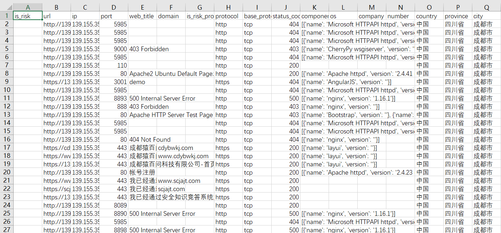

## HunterExport 全球鹰数据导出。

由于全球鹰目前仅支持每天导出1000条数据，因此编写了该脚本调用查询API，可无限制导出查询结果至Excel表格。

目前全球鹰仅对公司内部开放，因此全程需要**接入公司内网**，即拨入VPN。接入公司内网后，登录安服武器库全球鹰Hunter获取用户名（邮箱）和密钥（Key），写入default.conf配置文件，运行 HunterEcport.py 输入查询指令即可获取数据，并输出至文件。

配置文件内容：

-   mail = example@qianxin.com
-   key = abcdefgh12345678987654321hgfedcba
-   countMax = 5000      查询导出数量
-   searchMonth = 6      查询时间段（几月内）

按需修改即可。

```
Usage: python3 HunterExport.py
    Command> app="***"
```




**欢迎使用。**
